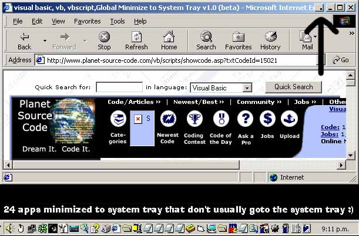

<div align="center">

## Global Minimize to System Tray v1\.0 \(beta\)


</div>

### Description

*UPDATED* New URL:

http://www.planet-source-code.com/xq/ASP/txtCodeId.15030/lngWId.1/qx/vb/scripts/ShowCode.htm

This is a VERY cool app. It adds a button to the windows default buttons for forms (X, Max/Restore, Minimize) for Minimize to System Tray. This is a fully working version tested in WinNT (2K) and Win98. Please comment on any bugs Apart from: 'Some windows stay on task bar' - I'm fixing that at the moment.. (note, you can send upto 999 apps to the system tray.. I wouldn't try it though..)
 
### More Info
 
Creates a Minimize to System Tray button on the active window IF it is not a child window (and not a ICQ window).


<span>             |<span>
---                |---
**Submitted On**   |2001-02-05 22:58:58
**By**             |[SKoW](https://github.com/Planet-Source-Code/PSCIndex/blob/master/ByAuthor/skow.md)
**Level**          |Advanced
**User Rating**    |4.6 (23 globes from 5 users)
**Compatibility**  |VB 6\.0
**Category**       |[Complete Applications](https://github.com/Planet-Source-Code/PSCIndex/blob/master/ByCategory/complete-applications__1-27.md)
**World**          |[Visual Basic](https://github.com/Planet-Source-Code/PSCIndex/blob/master/ByWorld/visual-basic.md)
**Archive File**   |[CODE\_UPLOAD14542252001\.zip](https://github.com/Planet-Source-Code/skow-global-minimize-to-system-tray-v1-0-beta__1-15021/archive/master.zip)

### API Declarations

```
'Plenty - Sorry about messy code, a few routines that aren't used but I will tidy up in later release.. after bugs at the moment
' UPDATED!!.. New URL:
http://www.planet-source-code.com/xq/ASP/txtCodeId.15030/lngWId.1/qx/vb/scripts/ShowCode.htm
```


